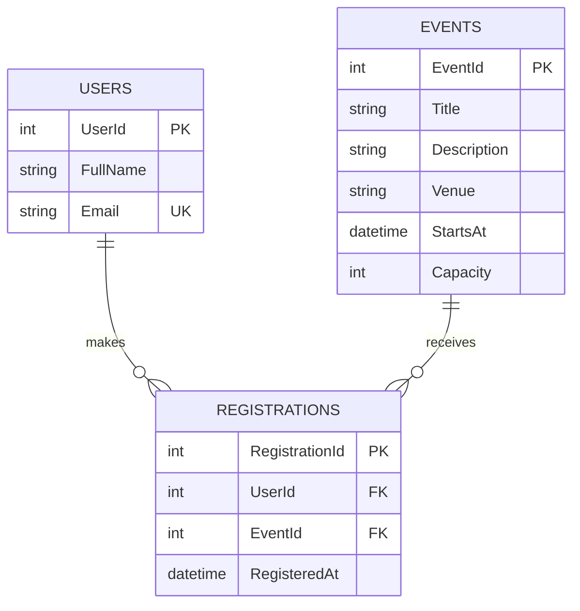

# TenZionado - Online Campus Event Management System

## Team Roster

Group name: TenZionado

| Member | Name | Role | Assigned tasks |
| --- | --- | --- | --- |
| 1 | Armon Jhon M. Remaldora | Systems Architect and Prompt Lead | Task 1, Task 5, Task 4 (security refactor) |
| 2 | Aljo | Frontend Engineer | Task 2 |
| 3 | Sebastian Joaquin S. Alvarado | Database and Backend Engineer | Task 3, Task 4 (unit tests) |

## Repository Structure

| Path | Contents |
| --- | --- |
| /frontend | index.html, styles.css, app.js, assets/campus.svg |
| /backend | ASP.NET Core minimal API, RegistrationService.cs, Validation.cs, EventRepository.cs |
| /database | schema.sql, seed.sql |
| /tests | xUnit tests for RegistrationValidator with a mock seat-availability object |
| /documentation/ai-outputs | Full, unedited prompt and AI output for Tasks 1 to 4 |
| /documentation/screenshots | Frontend, database, unit test and repository screenshots |
| CampusEvents.sln | Visual Studio 2022 solution (backend + tests) |

## Task 1 - Architecture

### Prompt (RCTC)

```text
Role: Act as a lead systems architect.
Context: A team of 3 BSIT students has 180 minutes to build an Online Campus
Event Management System. Students view upcoming events and register;
administrators view registered attendees.
Task: Propose the architecture, database entities, API endpoints, folder
structure, and division of work. Use semantic HTML, CSS, vanilla JavaScript,
ASP.NET Core, and SQL Server. Include a short scope assessment.
Constraints: Do not use third-party state management libraries like Redux.
Do not use microservices, payment processing, or email delivery. Keep
database passwords out of source control. Keep it small enough to finish in
3 hours.
```

### AI output (Google Gemini)

Screenshot: documentation/screenshots/gemini_task1.png

````markdown
## Scope Assessment: The 180-Minute MVP

Three hours is a sprint. To guarantee a working deliverable, we must aggressively cut scope. We will omit a formal login system. Students will register by simply entering their Student ID and Name into a form. The admin dashboard will be a standalone, unlinked HTML page (`/admin.html`) rather than protected by role-based authorization. We will use a single monolithic project to avoid cross-origin (CORS) setup time, serving the frontend directly from the backend.

## Architecture Proposal

- **Pattern:** Monolithic Web API with static file hosting.
- **Backend:** ASP.NET Core Web API handling HTTP requests and business logic.
- **Database Access:** Entity Framework (EF) Core connecting to SQL Server.
- **Frontend:** Semantic HTML5, standard CSS, and vanilla JavaScript hosted in the `wwwroot` folder. State will be managed entirely in the DOM using standard event listeners and the Fetch API.
- **Security:** Database connection strings must be stored using the `dotnet user-secrets` tool or kept in a local `appsettings.Development.json` that is explicitly added to `.gitignore`. Never commit credentials.

## Database Entities

To save time, we will denormalize the `Student` into the `Registration` table. This eliminates the need to manage a separate Student CRUD process.

| Entity | Primary Key | Attributes | Navigation Properties |
| --- | --- | --- | --- |
| Event | Id (Guid) | Title (string), Description (string), EventDate (datetime), Location (string) | ICollection<Registration> Registrations |
| Registration | Id (Guid) | StudentId (string), StudentName (string), RegisteredAt (datetime) | EventId (Guid), Event Event |

## API Endpoints

Keep controllers thin. Use simple Data Transfer Objects (DTOs) to prevent over-posting and circular reference loops during JSON serialization.

| Method | Endpoint | Purpose | Request Body | Response |
| --- | --- | --- | --- | --- |
| GET | /api/events | Fetch all upcoming events | None | 200 OK (Array of Events) |
| POST | /api/events/{id}/register | Register a student | { studentId, studentName } | 201 Created |
| GET | /api/events/{id}/attendees | Admin view of registrations | None | 200 OK (Array of Registrations) |

## Folder Structure

Keep everything in a single ASP.NET Core solution to eliminate CORS configuration and simplify execution.

```text
CampusEventManager/
├── Controllers/
│   └── EventsController.cs
├── Data/
│   └── AppDbContext.cs
├── Models/
│   ├── Event.cs
│   └── Registration.cs
├── DTOs/
│   └── RegistrationDto.cs
├── wwwroot/
│   ├── index.html        (Student View: Semantic tags <header>, <main>, <article>)
│   ├── admin.html        (Admin View)
│   ├── css/
│   │   └── style.css
│   └── js/
│       ├── app.js        (DOM manipulation, Event Listeners)
│       └── api.js        (Fetch calls)
├── appsettings.json
├── Program.cs            (Configure services, AddControllers, UseStaticFiles)
└── CampusEventManager.csproj
```

## Division of Work

To maximize the 180 minutes, the team must work in parallel.

**Developer 1: Database & Infrastructure (Minutes 0 - 90)**

- Initialize the ASP.NET Core Web API project.
- Create the Event and Registration model classes.
- Configure AppDbContext and wire up EF Core.
- Use `dotnet user-secrets` to configure the SQL Server connection string.
- Run Entity Framework migrations and seed the database with 3 dummy events so the frontend has data to fetch.

**Developer 2: API & Backend Logic (Minutes 30 - 120)**

- Prerequisite: Dev 1 finishes the Models.
- Build the EventsController.
- Implement the GET endpoints for events and attendees.
- Implement the POST endpoint for registration, ensuring basic validation (e.g., checking if the EventId exists before saving).
- Test all endpoints locally using Swagger/Postman to ensure clean JSON responses.

**Developer 3: Frontend UI & Integration (Minutes 0 - 150)**

- Write semantic HTML (index.html and admin.html) and basic CSS grid/flexbox layouts. Do not waste time on pixel-perfect design.
- Write the vanilla JavaScript fetch() calls in api.js.
- Prerequisite: Dev 2 finishes endpoints (or use mock JSON files temporarily).
- Wire the DOM: dynamically render the event list into HTML `<article>` cards, attach submit listeners to the registration form, and render the attendee table on the admin page.

**The Final 30 Minutes (Minutes 150 - 180): Team Integration**

All three developers stop building. Pull code together, resolve merge conflicts, ensure the static files are being served correctly by Program.cs via `app.UseStaticFiles()`, and conduct an end-to-end test of registering a student and viewing them on the admin page.
````

### Manual Grounding Evaluation

Gemini's plan is mostly doable in 180 minutes because it keeps everything in one ASP.NET Core app that serves the frontend from wwwroot, which avoids CORS, and it keeps the connection string in user secrets. The parts we could not use were the data and security shortcuts: it put the student's ID and name inside the Registration table instead of a separate Users table, which breaks the 3NF design we need in Task 3, and it left the admin attendee page as an unprotected HTML page that anyone with the link could open. It also never added an event capacity or a duplicate-registration check, so nothing stops an event from being overbooked. We kept the single app, user secrets and the parallel split with a final 30-minute integration, but added a Users table, a Capacity column with a seat check, a unique (UserId, EventId) rule, a server-side admin key, and used plain ADO.NET instead of EF Core migrations.

## Task 2 - Frontend

Prompt:

```text
Act as a frontend engineer. Build an Event Catalog and Registration Form for an
Online Campus Event Management System using plain HTML, CSS and JavaScript.
Use semantic HTML5 tags (<header>, <main>, <section>, <article>, <footer>)
instead of generic div wrappers. Follow WCAG (POUR): visible <label> for every
input, aria-label attributes on input fields, alt text on images, and
accessible color contrast. Do not use any frontend framework.
```

AI output (Google Gemini): documentation/ai-outputs/task2.md (single-file index.html). Screenshot: documentation/screenshots/gemini_task2.png

Final source: /frontend. The page uses `header`, `nav`, `main`, `section`, `article` (event cards built in app.js) and `footer`. Every input has a visible `<label for>` and an `aria-label`, the image has alt text, status messages use `role="status"`, and there is a skip link with visible keyboard focus. An axe-core accessibility scan (WCAG 2.0/2.1 A and AA rules) in Chromium returned 0 violations after the corrections in the verification log.

## Task 3 - Database

Prompt:

```text
Act as a database engineer. Design a SQL Server schema in Third Normal Form
(3NF) for an Online Campus Event Management System with at least 3 tables:
Users, Events, and Registrations. Output an Entity-Relationship Diagram in
Mermaid.js code format. Then generate a production-grade SQL DDL script with
explicit foreign key rules (ON DELETE / ON UPDATE), CHECK constraints, and
non-clustered indexes on all foreign key columns. Explain why it is 3NF.
```

AI output (Google Gemini): documentation/ai-outputs/task3.md (Mermaid ERD, DDL and 3NF explanation). Screenshot: documentation/screenshots/gemini_task3.png

### Mermaid ERD



DDL: /database/schema.sql. Sample data: /database/seed.sql.

- 3NF: every non-key column depends only on its table's primary key. Student name and email live only in Users, event details only in Events, and Registrations stores only the two foreign keys and the registration time. Seat counts are calculated, not stored.
- Foreign keys: `FK_Registrations_Users` and `FK_Registrations_Events` use `ON DELETE NO ACTION ON UPDATE NO ACTION`.
- CHECK constraints: name length, email shape and `@univ.edu.ph` domain, non-blank title and venue, capacity 1 to 10000.
- Non-clustered indexes on foreign keys: `UQ_Registrations_User_Event` (UserId, EventId) covers UserId, `IX_Registrations_EventId` covers EventId.
- Result: schema.sql and seed.sql ran without errors on SQL Server LocalDB (`(localdb)\MSSQLLocalDB`) from Visual Studio 2022. The catalog check returned the 3 tables, both foreign keys as NO_ACTION, the 5 CHECK constraints, both non-clustered indexes and the 3 seeded events (documentation/screenshots/database_01_localdb_results.png).

## Task 4 - Security and Unit Testing

Security prompt:

```text
Act as a security engineer. Diagnose this C# method for SQL injection risks
and memory/resource leaks, then refactor it using parameterized queries and
using statements. Do not hardcode the connection string.

public string GetUserRegistration(string inputEmail) {
   string connStr = "Server=myServerAddress;Database=myDataBase;User Id=myUsername;Password=myPassword;";
   SqlConnection conn = new SqlConnection(connStr);
   conn.Open();
   SqlCommand cmd = new SqlCommand("SELECT * FROM Registrations WHERE Email = '" + inputEmail + "'", conn);
   return cmd.ExecuteScalar().ToString();
}
```

AI output (Google Gemini): documentation/ai-outputs/task4_security.md. Screenshot: documentation/screenshots/gemini_task4_security.png

Unit test prompt:

```text
Write xUnit unit tests for a C# RegistrationValidator that checks @univ.edu.ph emails and seat availability, using a mock object for seat availability.
```

AI output (Google Gemini): documentation/ai-outputs/task4_unit_tests.md. Screenshot: documentation/screenshots/gemini_task4_unit_tests.png

Final code:

- /backend/RegistrationService.cs: the email is passed as a typed parameter (`@Email`, NVarChar 254), so it can never run as SQL. `SqlConnection` and `SqlCommand` are both in `using` blocks so they are disposed even on errors. The connection string is injected from user secrets, not hardcoded. A missing row returns `null` instead of crashing on `.ToString()`.
- /tests/RegistrationValidatorTests.cs: `SeatMock` implements `ISeatAvailability` so the validator is tested without SQL Server. The tests cover valid emails, invalid and spoofed domains, a full event, an invalid event id, and a missing or too-long name, and check that the mock is never called when the input is invalid.
- Result: solution built and all 14 tests passed in Visual Studio 2022 Test Explorer (documentation/screenshots/tests_01_all_passed.png).

## Task 5 - Integration

### Setup Instructions

1. Install Visual Studio 2022 with the ASP.NET and web development workload (includes the .NET 8 SDK and SQL Server LocalDB).
2. Create the database: in SQL Server Object Explorer or SSMS, connect to `(localdb)\MSSQLLocalDB`, create an empty database named `CampusEvents`, then run `database/schema.sql` and then `database/seed.sql` once.
3. Set the secrets from the project root (PowerShell). Nothing secret is stored in the repository.

```powershell
dotnet user-secrets set "ConnectionStrings:CampusEvents" "Server=(localdb)\MSSQLLocalDB;Database=CampusEvents;Integrated Security=true;Encrypt=true;TrustServerCertificate=true" --project backend
$campusAdminKey = [guid]::NewGuid().ToString("N")
dotnet user-secrets set "AdminKey" "$campusAdminKey" --project backend
```

4. Open `CampusEvents.sln` in Visual Studio. Run the tests with Test > Run All Tests, or from a terminal:

```powershell
dotnet test tests/CampusEvents.Tests.csproj
```

5. Run the app and open http://localhost:5080:

```powershell
dotnet run --project backend/CampusEvents.csproj -- --urls http://localhost:5080
```

6. Register with an `@univ.edu.ph` email. Use the admin key from step 3 in the Registered attendees section to see the attendee list.

### AI Disclosure Statement

- ChatGPT (OpenAI) generated the first version of the project code: frontend, SQL schema and seed data, C# backend and unit tests.
- Google Gemini (gemini.google.com) was used for the Task 1 to Task 4 prompts recorded above. The prompts and Gemini's answers are saved in documentation/ai-outputs, with screenshots in documentation/screenshots/gemini_*.png.
- Claude (Anthropic) helped with checking the work: comparing the Gemini answers with our code, running an axe-core accessibility scan of the frontend in Chromium, building the solution, running the tests and running the database script on LocalDB in Visual Studio 2022, and drafting this document.
- Every AI output was checked by the group before anything was kept. The flaws we found and fixed are listed in the verification log below.

### Group Verification Log

| Task # | Identified AI flaw / limitation | Manual correction applied | Member responsible |
| --- | --- | --- | --- |
| Task 1 | Gemini stored the student's ID and name directly in the Registration table ("denormalize the Student into the Registration table"), which breaks the 3NF design required in Task 3. It also left /admin.html unprotected and had no event capacity or duplicate-registration check. | Kept a separate Users table, added Capacity to Events with a seat check inside a transaction, added a unique (UserId, EventId) rule, and protected the attendee endpoint with a server-side admin key compared using `CryptographicOperations.FixedTimeEquals`. Used plain ADO.NET instead of EF Core migrations. | Armon |
| Task 2 | The prompt asked for aria-label attributes on input fields, but Gemini's form inputs had none (only the buttons and links did). It also wrapped the layout in generic `div`s, accepted any email domain, used hardcoded events, and told students "A confirmation email has been sent" even though email delivery was out of scope. Browser testing of our own page also found two accessible-name mismatches (WCAG 2.5.3). | Every input in frontend/index.html has a visible `<label for>` plus an aria-label, and the email input has `aria-describedby` help text. Used `section`/`article` elements instead of div wrappers, enforced `@univ.edu.ph`, loaded events from the API, and removed any email claim. Fixed the "Full" button and admin key labels so the accessible name starts with the visible text. Re-ran axe-core in Chromium: 0 violations. | Aljo |
| Task 3 | Gemini's DDL used ON DELETE CASCADE from Events to Registrations (deleting an event silently erases its attendance records) and ON UPDATE CASCADE on IDENTITY keys, which can never be updated. It had no CHECK on the email domain or on blank names, and its separate IX_Registrations_EventID index duplicated the leading column of the UNIQUE (EventID, UserID) index. | Set both Registrations foreign keys to ON DELETE NO ACTION / ON UPDATE NO ACTION, added CHECK constraints for the `@univ.edu.ph` domain, names, title, venue and capacity, and ordered the unique key as (UserId, EventId) so the separate `IX_Registrations_EventId` index is not redundant. Ran schema.sql and seed.sql on LocalDB and confirmed the keys, checks and indexes in sys.foreign_keys, sys.check_constraints and sys.indexes. | Sebastian |
| Task 4 | Gemini's refactor queries `RegistrationDetails` and `Email` from Registrations, columns that do not exist in our 3NF schema (email is in Users), with no ORDER BY when a student has several registrations. Its unit-test validator only checks `EndsWith("@univ.edu.ph")`, so `a@@univ.edu.ph`, `a b@univ.edu.ph` and `@univ.edu.ph` would pass, and it depends on Moq and a string course code instead of our int event id. | Rewrote the query to JOIN Users with `TOP (1) ... ORDER BY RegisteredAt DESC` and an NVarChar(254) parameter. Our validator parses the address with `MailAddress.TryCreate` and checks the host exactly; tests for the double-@ and space cases were added with a hand-written `SeatMock`. Built and ran the 14 tests in Visual Studio 2022: all passed. | Armon and Sebastian |
