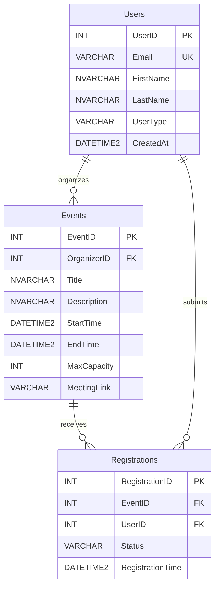

# Task 3 - Database schema

Tool: Google Gemini (gemini.google.com), 2026-10-02

## Prompt

```text
Act as a database engineer. Design a SQL Server schema in Third Normal Form (3NF) for an Online Campus Event Management System with at least 3 tables: Users, Events, and Registrations. Output an Entity-Relationship Diagram in Mermaid.js code format. Then generate a production-grade SQL DDL script with explicit foreign key rules (ON DELETE / ON UPDATE), CHECK constraints, and non-clustered indexes on all foreign key columns. Explain why it is 3NF.
```

## Gemini output

Code snippet



## SQL Server DDL Script

This production-grade script includes defensive constraints, surrogate keys, and structural protections specific to SQL Server (including the prevention of multiple cascade path errors).

```sql
-- Create database and switch context
CREATE DATABASE CampusEventsDB;
GO
USE CampusEventsDB;
GO

-- ==========================================
-- 1. USERS TABLE
-- ==========================================
CREATE TABLE Users (
    UserID INT IDENTITY(1,1) 
        CONSTRAINT PK_Users PRIMARY KEY,
    Email VARCHAR(255) 
        CONSTRAINT UQ_Users_Email UNIQUE NOT NULL,
    FirstName NVARCHAR(100) NOT NULL,
    LastName NVARCHAR(100) NOT NULL,
    UserType VARCHAR(20) NOT NULL 
        CONSTRAINT CHK_Users_UserType CHECK (UserType IN ('Student', 'Faculty', 'Staff', 'Alumni')),
    CreatedAt DATETIME2 
        CONSTRAINT DF_Users_CreatedAt DEFAULT SYSDATETIME() NOT NULL
);
GO

-- ==========================================
-- 2. EVENTS TABLE
-- ==========================================
CREATE TABLE Events (
    EventID INT IDENTITY(1,1) 
        CONSTRAINT PK_Events PRIMARY KEY,
    OrganizerID INT NOT NULL,
    Title NVARCHAR(200) NOT NULL,
    Description NVARCHAR(MAX) NULL,
    StartTime DATETIME2 NOT NULL,
    EndTime DATETIME2 NOT NULL,
    MaxCapacity INT NOT NULL 
        CONSTRAINT CHK_Events_MaxCapacity CHECK (MaxCapacity > 0),
    MeetingLink VARCHAR(2048) NULL,
    
    -- Foreign Key: Links to Users
    CONSTRAINT FK_Events_Users FOREIGN KEY (OrganizerID) 
        REFERENCES Users(UserID)
        ON DELETE NO ACTION
        ON UPDATE CASCADE,
        
    -- Table-level constraint to ensure chronological integrity
    CONSTRAINT CHK_Events_Dates CHECK (EndTime > StartTime)
);
GO

-- Create Non-Clustered Index on Foreign Key
CREATE NONCLUSTERED INDEX IX_Events_OrganizerID 
    ON Events(OrganizerID);
GO

-- ==========================================
-- 3. REGISTRATIONS TABLE (Intersection Table)
-- ==========================================
CREATE TABLE Registrations (
    RegistrationID INT IDENTITY(1,1) 
        CONSTRAINT PK_Registrations PRIMARY KEY,
    EventID INT NOT NULL,
    UserID INT NOT NULL,
    Status VARCHAR(20) NOT NULL 
        CONSTRAINT CHK_Registrations_Status CHECK (Status IN ('Registered', 'Waitlisted', 'Cancelled')),
    RegistrationTime DATETIME2 
        CONSTRAINT DF_Registrations_Time DEFAULT SYSDATETIME() NOT NULL,
        
    -- Composite Unique Constraint prevents double-registering for the same event
    CONSTRAINT UQ_Registrations_EventUser UNIQUE (EventID, UserID),

    -- Foreign Key: Links to Events
    CONSTRAINT FK_Registrations_Events FOREIGN KEY (EventID) 
        REFERENCES Events(EventID)
        ON DELETE CASCADE
        ON UPDATE CASCADE,

    -- Foreign Key: Links to Users
    -- NOTE: ON DELETE NO ACTION prevents SQL Server's "multiple cascade paths" error 
    -- (User -> Event -> Registration vs User -> Registration)
    CONSTRAINT FK_Registrations_Users FOREIGN KEY (UserID) 
        REFERENCES Users(UserID)
        ON DELETE NO ACTION 
        ON UPDATE NO ACTION
);
GO

-- Create Non-Clustered Indexes on Foreign Keys
CREATE NONCLUSTERED INDEX IX_Registrations_EventID 
    ON Registrations(EventID);
GO

CREATE NONCLUSTERED INDEX IX_Registrations_UserID 
    ON Registrations(UserID);
GO
```

## Third Normal Form (3NF) Validation

This schema strictly adheres to the rules of 3NF through the following characteristics:

- **First Normal Form (1NF):** All columns contain atomic, indivisible values. There are no repeating groups or arrays (e.g., a single user cannot have a comma-separated list of EventIDs stored in a single column). Every table has a clearly defined Primary Key (UserID, EventID, RegistrationID).
- **Second Normal Form (2NF):** The schema satisfies 1NF, and there are no partial dependencies. Because we utilize single-column surrogate integer keys (identity columns) for all Primary Keys, it is structurally impossible for a non-key attribute to depend on only a portion of the Primary Key.
- **Third Normal Form (3NF):** The schema satisfies 2NF, and there are no transitive dependencies. Every non-key attribute depends entirely on the primary key, the whole primary key, and nothing but the primary key.
  - In the Events table, attributes like Title and StartTime rely solely on the EventID. They do not rely on the OrganizerID. If an organizer changes their Email, it updates in the Users table and propagates virtually via the foreign key, eliminating data anomaly risks.
  - If user profile data was stored inside Registrations, it would be a 3NF violation. Instead, Registrations only stores the UserID and data specific to the act of registering (Status, RegistrationTime), forcing the system to JOIN against Users to retrieve the Email or Name.
